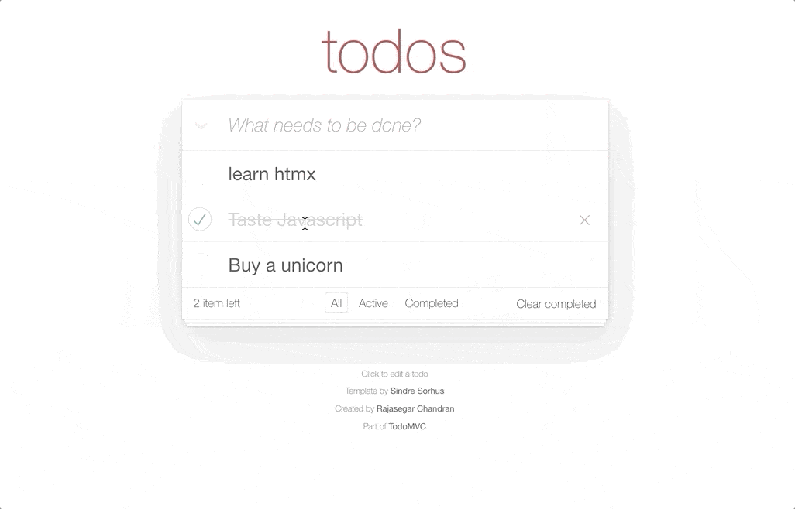

# htmx • [TodoMVC](http://todomvc.com)

> htmx - high power tools for HTML

## Resources

- [Website](https://htmx.org)
- [Documentation](https://htmx.org/docs)
- [Discord](https://htmx.org/discord)

### Articles

- [Locality of Behavior](https://htmx.org/essays/locality-of-behaviour)
- [Complexity Budget](https://htmx.org/essays/complexity-budget)
- [SPA Alternative](https://htmx.org/essays/spa-alternative)

### Support

- [Stack Overflow](http://stackoverflow.com/questions/tagged/htmx)
- [Twitter](http://twitter.com/htmx_org)

*Let us [know](https://github.com/tastejs/todomvc/issues) if you discover anything worth sharing.*

## Implementation

This app was created as [express](https://expressjs.com)(Node.js) app in the backend and 
**No Javascript code** in the frontend, thanks to [htmx](https://htmx.org) and [hyperscript](https://hyperscript.org).

## Credit

Created by [Rajasegar Chandran](https://twitter.com/rajasegar_c)
